<h3><code>vishant@github ~ $ whoami</code></h3>

 

<h3><code>vishant@github ~ $ ./contributions.sh</code></h3>

  

<h3><code>vishant@github ~ $ ./links.sh</code></h3>

<b>Software Engineer · Full Stack Developer · ERP Developer</b>

  

<b>Tech Stack</b> 
HTML · CSS · JavaScript · React · Node.js · Express · MongoDB · Git · GitHub · Zoho Creator · Deluge

 

